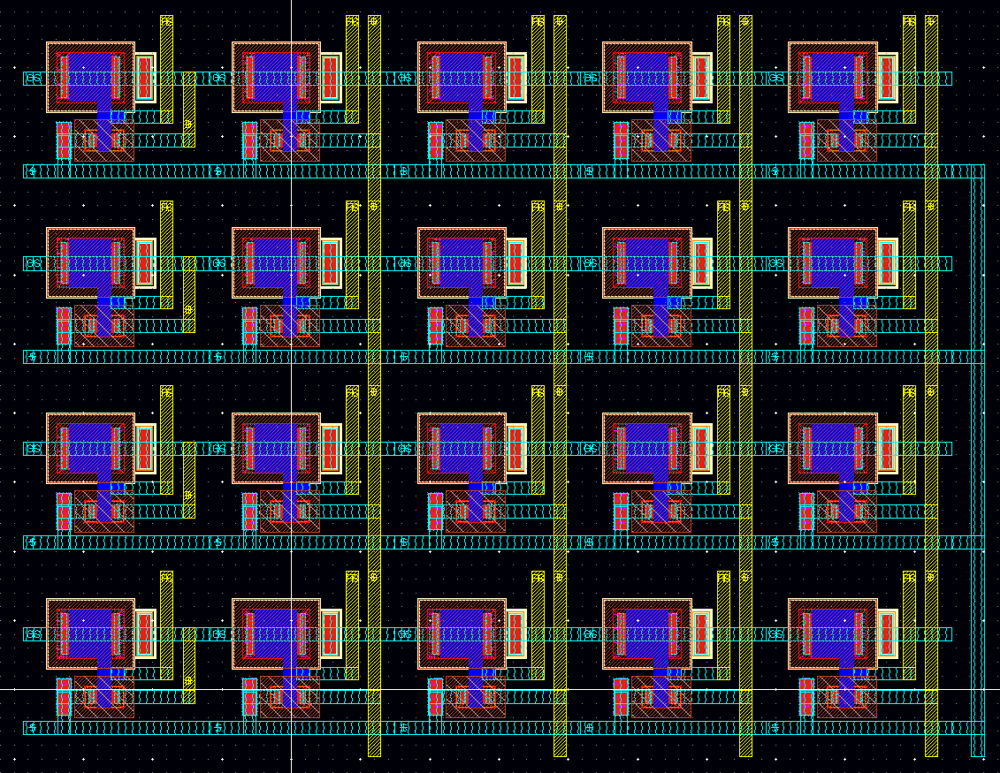

# CM_VMM — Analog Current-Mode Vector-Matrix Multiplier (MOS Subthreshold)

Project implementing an **analog vector-by-matrix multiplier (VMM)** based on **current mirrors operating in the MOS subthreshold region**.

This design exploits the physics of MOS transistors biased below threshold to perform ultra-low power analog multiplication and accumulation directly in the analog domain. The core idea is to use arrays of current mirrors where input currents are scaled by programmable mirror ratios (weights) to compute the weighted sums that form the vector-matrix product.

The project is intended for research and educational use in **mixed-signal compute circuits for AI inference**, and aligns with emerging interests in analog acceleration for AI and neural computing.

---

## Key Features

- **Analog multiply-accumulate (MAC) engine** using MOS current mirrors
- **Subthreshold operation** for low-power analog computing
- Supports **vector × matrix computation** in current mode
- Uses programmable mirror ratios as analog weights
- Study of key features such as multiplication factors and ENOB with respect to design parameters

---

## Documentation

The primary project description and design specifications are provided in `CurrentMirrorVMM.pptx` – architecture, diagrams, and detailed explanation.

---

## Author

**kasetron**  
Feel free to open issues or contribute on GitHub.
